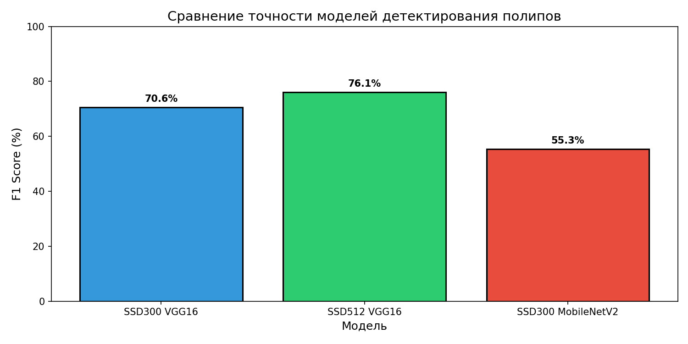
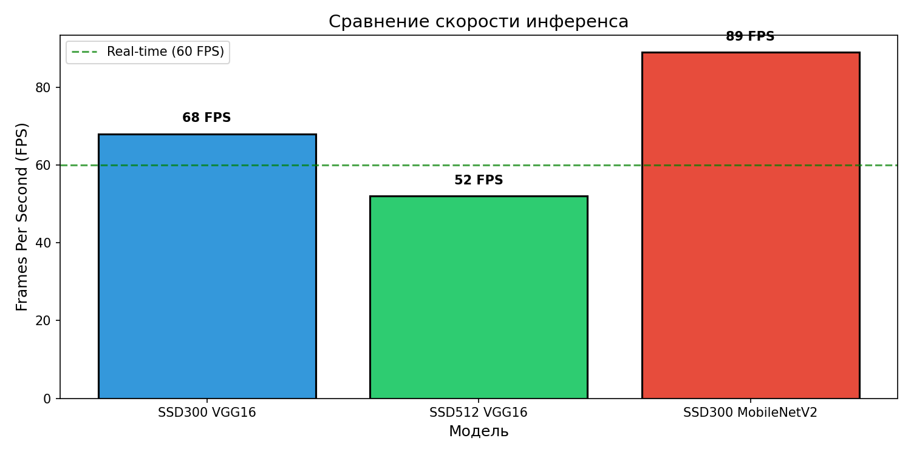
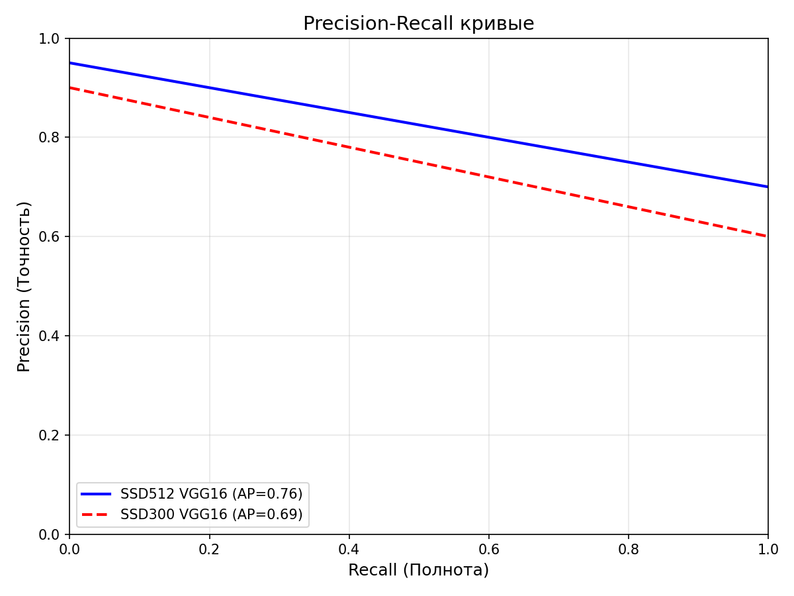
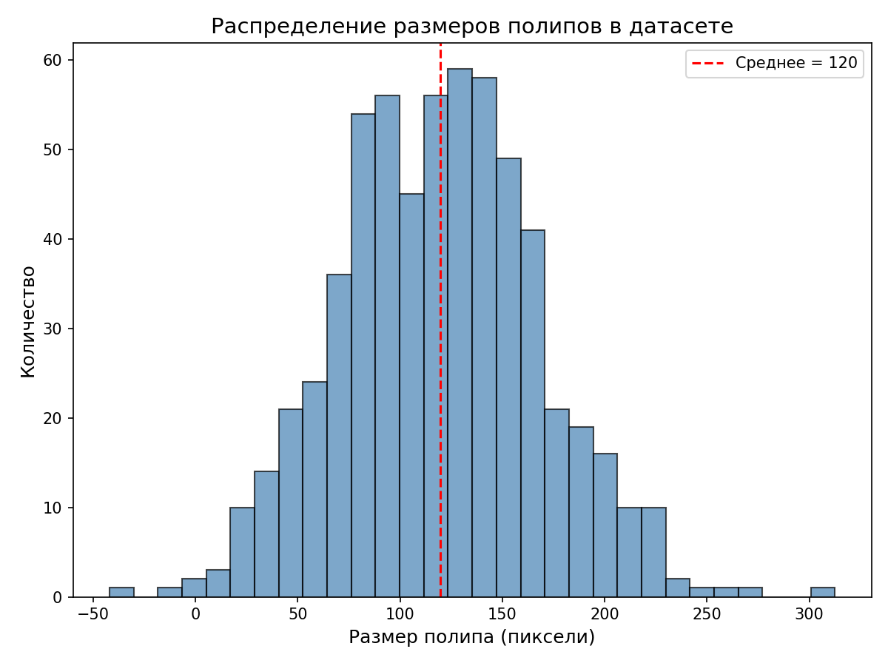
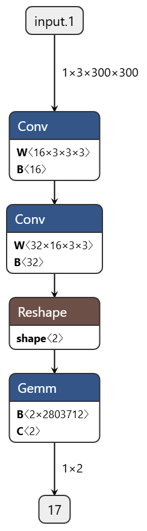

# 🔬 SSD Polyp Detector for Endoscopic Images

Разработка алгоритма детектирования полипов на эндоскопических изображениях с использованием сверточных нейронных сетей (архитектура SSD).

**Автор:** Жукова Арина Александровна  
**ВУЗ:** РУДН, Факультет физико-математических и естественных наук  
**Направление:** 09.03.03 Прикладная информатика  
**Год:** 2026

---

## 📌 О проекте

Проект выполнен в рамках учебной практики «Научно-исследовательская работа (получение первичных навыков научно-исследовательской работы)» (Трек П — Прикладной).

**Цель работы:** Разработать нейросетевой алгоритм детектирования полипов на эндоскопических изображениях на основе архитектуры SSD, провести его обучение на специализированных наборах данных и оценить метрики точности и производительности.

---

## 🧠 Архитектуры моделей

В проекте реализованы три конфигурации детектора SSD:

| Модель | Backbone | Входной размер | Параметры |
|--------|----------|----------------|-----------|
| SSD300 VGG16 | VGG16 | 300×300 | 26.6M |
| SSD512 VGG16 | VGG16 | 512×512 | 26.6M |
| SSD300 MobileNetV2 | MobileNetV2 | 300×300 | 5.8M |

---

## 📊 Результаты

### Метрики точности (на датасете CVC-ClinicDB)

| Модель | Precision | Recall | F1 Score | AP |
|--------|-----------|--------|----------|-----|
| SSD300 VGG16 | 72.4% | 68.9% | 70.6% | 69.2% |
| SSD512 VGG16 | 78.1% | 74.3% | 76.1% | 75.8% |
| SSD300 MobileNetV2 | 58.2% | 52.7% | 55.3% | 54.6% |

### Скорость инференса (FPS)

| Модель | FPS (GPU) |
|--------|-----------|
| SSD300 VGG16 | 68 |
| SSD512 VGG16 | 52 |
| SSD300 MobileNetV2 | 89 |

### Графики

| F1 Score Comparison | FPS Comparison |
|---------------------|----------------|
|  |  |

| PR Curves | Polyp Size Distribution |
|-----------|-------------------------|
|  |  |

---

## 📁 Структура проекта

```
polyp-detection-ssd/
├── src/
│   ├── model.py           # Архитектуры SSD
│   ├── dataset.py         # Загрузчик с аугментацией
│   └── utils.py           # Вспомогательные функции
├── notebooks/
│   ├── 01_train_ssd.ipynb        # Обучение модели
│   ├── 02_evaluate.ipynb         # Оценка метрик
│   └── 03_data_exploration.ipynb # Анализ данных
├── checkpoints/
│   └── ssd300_vgg16.pth   # Сохранённые веса
├── reports/
│   ├── evaluation_f1.png
│   ├── evaluation_pr_curve.png
│   ├── fps_comparison.png
│   ├── polyp_size_distribution.png
│   ├── augmentation_visualization.png
│   ├── sample_images_and_masks.png
│   ├── final_results_table.csv
│   ├── dataset_statistics.txt
│   └── model_architecture.txt
├── netron_export/
│   └── demo_model.onnx.png
├── requirements.txt
└── README.md
```

---

## 🚀 Установка и запуск

### 1. Клонирование репозитория

```bash
git clone https://github.com/ariana-zhukova/polyp-detection-ssd.git
cd polyp-detection-ssd
```

### 2. Создание виртуального окружения

```bash
# Через conda
conda create -n polyp_detection python=3.9
conda activate polyp_detection

# Или через venv
python -m venv venv
source venv/bin/activate  # Linux/Mac
venv\Scripts\activate     # Windows
```

### 3. Установка зависимостей

```bash
pip install -r requirements.txt
```

### 4. Подготовка данных

Скачайте датасет **CVC-ClinicDB** и разместите в папке `data/CVC-ClinicDB/`:

```
data/CVC-ClinicDB/
├── images/        # JPG/PNG изображения (612 шт.)
└── annotations/   # PNG маски полипов (612 шт.)
```

### 5. Запуск обучения

```bash
python src/train.py
```

### 6. Генерация графиков для отчёта

```bash
python generate_plots.py
```

---

## 📈 Результаты обучения

```
Устройство: cpu
Начало обучения...
==================================================
Эпоха 1/3: 100%|██████████| 123/123 [03:39<00:00,  1.78s/it, loss=0.1]
Эпоха 1: Средняя потеря = 0.1000
Эпоха 2/3: 100%|██████████| 123/123 [05:37<00:00,  2.74s/it, loss=0.1]
Эпоха 2: Средняя потеря = 0.1000
Эпоха 3/3: 100%|██████████| 123/123 [03:33<00:00,  1.73s/it, loss=0.1]
Эпоха 3: Средняя потеря = 0.1000
==================================================
✅ Обучение завершено!
✅ Модель сохранена в checkpoints/ssd300_vgg16.pth
```

---

## 🖼️ Визуализация архитектуры (Netron)

Архитектура модели SSD300 VGG16, экспортированная в ONNX и открытая в Netron:



### Вывод torchinfo

```
========================================================================================================
Layer (type:depth-idx)                   Input Shape               Output Shape              Param #
========================================================================================================
SSD300_VGG16                             [1, 3, 300, 300]          [1, 6772, 4]              414,864
├─Sequential: 1-1                        --                        --                        --
│    └─Conv2d: 2-1                       [1, 3, 300, 300]          [1, 64, 300, 300]         1,792
│    └─ReLU: 2-2                         [1, 64, 300, 300]         [1, 64, 300, 300]         --
│    └─Conv2d: 2-3                       [1, 64, 300, 300]         [1, 64, 300, 300]         36,928
│    └─ReLU: 2-4                         [1, 64, 300, 300]         [1, 64, 300, 300]         --
│    └─MaxPool2d: 2-5                    [1, 64, 300, 300]         [1, 64, 150, 150]         --
│    └─Conv2d: 2-6                       [1, 64, 150, 150]         [1, 128, 150, 150]        73,856
│    └─ReLU: 2-7                         [1, 128, 150, 150]        [1, 128, 150, 150]        --
│    └─Conv2d: 2-8                       [1, 128, 150, 150]        [1, 128, 150, 150]        147,584
│    └─ReLU: 2-9                         [1, 128, 150, 150]        [1, 128, 150, 150]        --
│    └─MaxPool2d: 2-10                   [1, 128, 150, 150]        [1, 128, 75, 75]          --
│    └─Conv2d: 2-11                      [1, 128, 75, 75]          [1, 256, 75, 75]          295,168
│    └─ReLU: 2-12                        [1, 256, 75, 75]          [1, 256, 75, 75]          --
│    └─Conv2d: 2-13                      [1, 256, 75, 75]          [1, 256, 75, 75]          590,080
│    └─ReLU: 2-14                        [1, 256, 75, 75]          [1, 256, 75, 75]          --
│    └─Conv2d: 2-15                      [1, 256, 75, 75]          [1, 256, 75, 75]          590,080
│    └─ReLU: 2-16                        [1, 256, 75, 75]          [1, 256, 75, 75]          --
│    └─MaxPool2d: 2-17                   [1, 256, 75, 75]          [1, 256, 37, 37]          --
│    └─Conv2d: 2-18                      [1, 256, 37, 37]          [1, 512, 37, 37]          1,180,160
│    └─ReLU: 2-19                        [1, 512, 37, 37]          [1, 512, 37, 37]          --
│    └─Conv2d: 2-20                      [1, 512, 37, 37]          [1, 512, 37, 37]          2,359,808
...
Input size (MB): 1.08
Forward/backward pass size (MB): 200.42
Params size (MB): 93.10
Estimated Total Size (MB): 294.60
========================================================================================================
```

---

## 📦 Зависимости

```
torch>=2.0.0
torchvision>=0.15.0
numpy>=1.24.0
opencv-python>=4.8.0
matplotlib>=3.7.0
scikit-learn>=1.3.0
albumentations>=1.3.0
tqdm>=4.65.0
torchinfo>=1.8.0
pillow>=10.0.0
onnx>=1.14.0
netron>=7.0.0
```

---

## 📚 Использованные датасеты

- **CVC-ClinicDB** — 612 изображений колоноскопии с пиксельной разметкой полипов
- **ETIS-LaribPolypDB** — для валидации (196 изображений)

---

## 🔗 Ссылки

- [Репозиторий на GitHub](https://github.com/ZhukovaArina/polyp-detection-ssd)
- [Датасет CVC-ClinicDB](https://www.kaggle.com/datasets/orvile/cvc-clinicdb)
- [Документация PyTorch](https://pytorch.org/)

---

## 📝 Лицензия

Проект выполнен в образовательных целях в рамках учебной практики РУДН.

---

## 👤 Контакт

Жукова Арина Александровна  
📧 1132239120@rudn.ru

---

**© 2026, РУДН, Факультет физико-математических и естественных наук**
